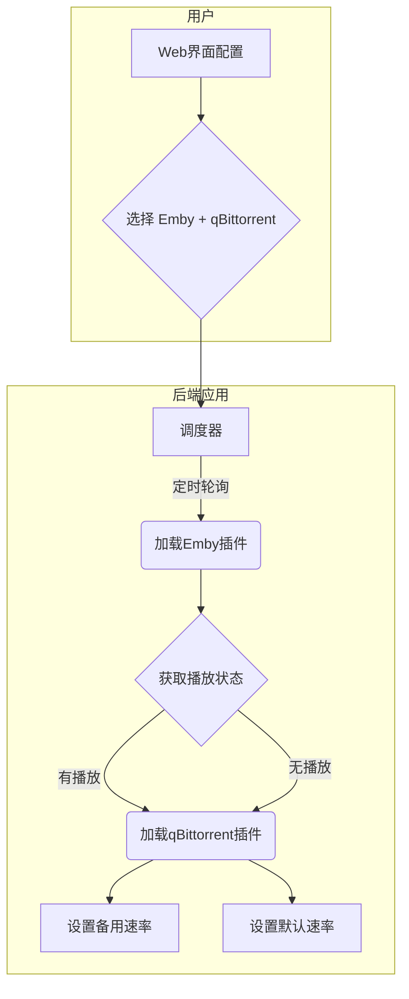

# 模块化自动速率控制器

这是一个基于插件化架构的Web应用，用于监控媒体服务器（如Emby, Jellyfin, Plex）的播放状态，并自动调节下载器（如qBittorrent, Transmission）的速率。

当有用户在媒体服务器上播放内容时，系统会自动将下载器切换到"备用速率"模式，以保障观看流畅；当所有播放停止后，则恢复为"默认速率"。

## 核心优势

- 🔌 **插件化架构**: 轻松扩展，可支持多种媒体服务器和下载器。
- 🌐 **统一Web界面**: 通过一个界面管理所有插件的配置和状态。
- 🚀 **动态加载**: 根据用户选择动态加载和配置相应模块。
- 📊 **实时状态与日志**: 提供清晰的播放状态、会话详情和事件日志。
- 🐳 **Docker化部署**: 使用Docker和Docker Compose快速部署和管理。
- 🔧 **开发者友好**: 清晰的基类和文件结构，方便开发者贡献新插件。

## 工作原理

应用的核心是一个调度器，它按固定的时间间隔执行以下任务：
1.  **加载插件**: 根据Web界面上的配置，动态加载选定的媒体服务器和下载器插件。
2.  **查询状态**: 调用媒体服务器插件的 `get_active_sessions()` 方法，获取当前活跃的播放会话。
3.  **状态比较**: 将当前会话与上一轮的状态进行比较。
4.  **触发调整**: 如果活跃会话数量发生变化（从0到有，或从有到0），则调用下载器插件的 `set_speed_limits()` 方法来更新速率。



## 快速开始

### 1. 准备文件

将项目所有文件下载到你的服务器上。

### 2. 启动服务

```bash
# 构建并以分离模式启动服务
docker-compose up -d --build

# 查看实时日志
docker-compose logs -f
```

### 3. 配置系统

1.  在浏览器中访问 `http://你的服务器IP:5002`。
2.  点击"配置"进入配置页面。
3.  **选择插件**:
    *   在"媒体服务器"下拉菜单中选择 `Emby`。
    *   在"下载器"下拉菜单中选择 `qBittorrent`。
4.  **填写配置**:
    *   填写所选插件（Emby和qBittorrent）的URL、API密钥、用户名和密码。
    *   设置默认速率和备用速率。
    *   设置轮询间隔。
5.  点击"保存配置"。系统将自动重启后台任务以应用新配置。

## 文件结构

```
.
├── app/
│   ├── downloaders/         # 下载器插件目录
│   │   ├── base.py          # 下载器基类
│   │   └── qbittorrent.py   # qBittorrent实现
│   ├── media_servers/       # 媒体服务器插件目录
│   │   ├── base.py          # 媒体服务器基类
│   │   └── emby.py          # Emby实现
│   ├── services/            # 核心服务目录
│   │   ├── config_manager.py # 配置管理器
│   │   ├── log_manager.py    # 日志管理器
│   │   └── scheduler.py      # 核心调度器
│   ├── templates/           # Web模板
│   ├── static/              # 静态文件(CSS, JS)
│   ├── __init__.py          # 应用工厂
│   └── routes.py            # Web路由
├── data/                    # (自动创建) 数据目录
│   ├── config.json
│   └── logs.json
├── run.py                   # 应用启动脚本
├── Dockerfile
├── docker-compose.yml
└── README.md
```

## 插件开发指南

要添加一个新的媒体服务器或下载器非常简单：

### 1. 创建新插件文件

-   **媒体服务器**: 在 `app/media_servers/` 目录下创建一个新文件，例如 `plex.py`。
-   **下载器**: 在 `app/downloaders/` 目录下创建一个新文件，例如 `transmission.py`。

### 2. 实现插件类

在新文件中，创建一个类并继承自相应的基类 (`MediaServerBase` 或 `DownloaderBase`)。

**示例: `plex.py`**
```python
from .base import MediaServerBase
from ..services.log_manager import log_manager

class Plex(MediaServerBase):
    def __init__(self, config):
        super().__init__(config)
        # 从config字典中获取Plex特有的配置
        self.url = self.config.get('plex_url')
        self.token = self.config.get('plex_token')

    def get_active_sessions(self):
        # 实现获取Plex活跃会话的逻辑...
        pass

    def test_connection(self):
        # 实现测试Plex连接的逻辑...
        pass
```

### 3. 更新前端界面

1.  **`app/templates/config.html`**:
    *   在媒体服务器/下载器的 `<select>` 下拉菜单中添加新的 `<option>`。
    *   仿照 `emby-settings` 或 `qbittorrent-settings` 的 `<div>`，为你的新插件创建一个配置块，并赋予一个匹配的ID（例如 `id="plex-settings"`）。
2.  **`app/services/config_manager.py`**:
    *   在 `get_settings` 方法返回的默认字典中，为新插件添加配置字段（例如 `'plex_url': ''`）。
3.  **`app/routes.py`**:
    *   在 `config()` 路由的 `POST` 逻辑中，添加从 `request.form` 获取新插件配置的代码。

完成以上步骤后，你的新插件就可以被系统动态加载和使用了。

## 故障排查

- **插件加载失败**: 检查 `docker-compose logs -f`，查看是否有 `PLUGIN_ERROR` 日志。通常是由于文件名和类名不匹配（例如 `plex.py` 文件需要一个 `Plex` 类）。
- **连接测试失败**: 使用Web界面的"测试连接"功能，并查看日志页面或Docker日志中的详细错误信息。
- **速率不切换**: 检查配置是否正确保存，并查看日志中是否有 `PLAY_START`/`PLAY_STOP` 和 `SPEED_CHANGE` 事件。
- **容器健康状态**:
  ```bash
  docker-compose ps
  # 检查容器状态详情
  docker inspect autolimit_controller | grep Health -A 10
  ```

## 安全建议
- 修改 `docker-compose.yml` 中的 `SECRET_KEY`。
- 如果需要公网访问，强烈建议使用反向代理（如Nginx Proxy Manager）并配置HTTPS。
- 定期备份 `app/data` 目录。

## 许可证

MIT License

## 支持

如果遇到问题，请检查：
1. 系统日志页面的错误信息
2. Docker容器日志
3. 网络连通性
4. 配置参数是否正确 